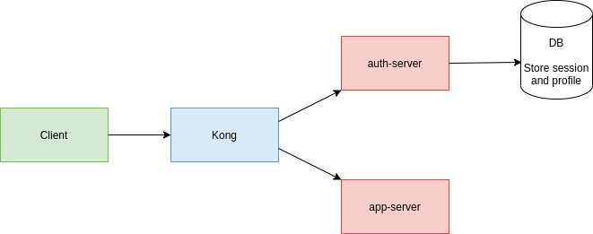

# Backend for frontends. Apigateway

Это пример простейшего Apigateway. Нам понадобится [minikube](https://minikube.sigs.k8s.io/docs/start/)

Есть два сервиса:

- сервис авторизации
- сервис приложения

Сервис приложения требует авторизации

## Сервис авторизации

- отвечает на порту 8000
- имеет следущие http-методы:
  - GET ​/hello
  - GET ​/health
  - POST ​/register
  - POST ​/login
  - GET ​/logout
  - GET ​/auth
  - PUT ​/edit

Пример body для создания пользователя:

```json
{
  "id": 0,
  "name": "string",
  "email": "string",
  "password": "string"
}
```

## Сервис приложения

- отвечает на порту 8000
- имеет следущие http-методы:
  - GET ​/hello
  - GET​ /health
  - GET​ ​/profile

## Схема взаимодействия



Приложена Postman коллекция, в которой представлены примеры запросов к сервису на создание, получение, изменение и удаление пользователя.

## Установка

```bash
minikube start \
--cpus=4 --memory=8g \
--cni=flannel

minikube tunnel # other console

helm repo add kong https://charts.konghq.com
helm repo update
helm install kong/kong --generate-name --set ingressController.installCRDs=false

HOST=$(kubectl get svc --namespace default kong-1631455313-kong-proxy -o jsonpath='{.status.loadBalancer.ingress[0].ip}')
PORT=$(kubectl get svc --namespace default kong-1631455313-kong-proxy -o jsonpath='{.spec.ports[0].port}')
export PROXY_IP=${HOST}:${PORT}

#add to /etc/hosts
10.111.90.80 arch.homework

#check
curl $PROXY_IP

sudo docker login
sudo systemctl restart docker
sudo docker build --tag adyakonov/auth-service:latest .
sudo docker push adyakonov/auth-service:latest

helm install auth ./auth-chart --atomic

#open
minikube service auth

sudo docker build --tag adyakonov/app-service:latest . 
sudo docker push adyakonov/app-service:latest

helm install app ./app-chart --atomic

#open
minikube service app

kubectl apply -f app-ingress.yaml
kubectl apply -f auth-ingress.yaml
```
