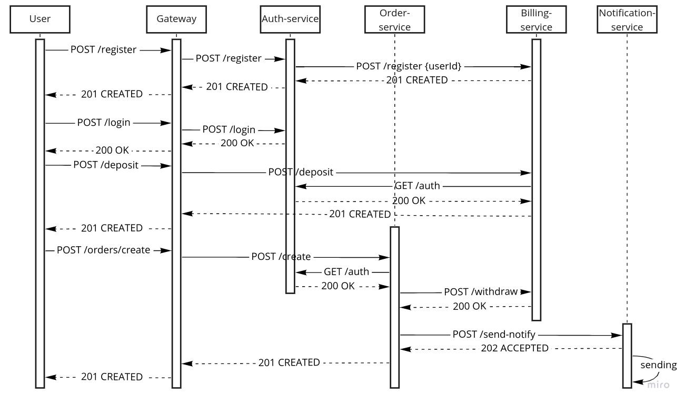

# Взаимодействие сервисов

Два типа взаимодействия:

- только HTTP взаимодействие
- событийное взаимодействие с использование брокера сообщений для нотификаций (уведомлений)

## Схема взаимодействия REST

## Схема взаимодействия REST + ASYNC

